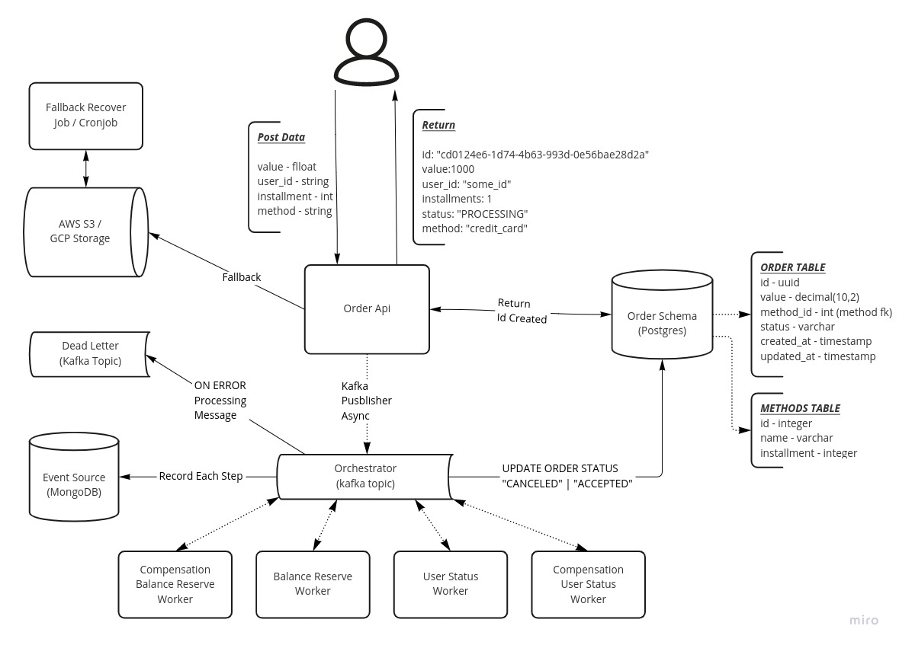

# Go Distributed System

An example of a system based in events, using an orchestrator to handle with order validation.


## Sumary

- [Architecture](#architecture)
- [Setup](#setup)
- [Running The Engine](#running-the-engine)
- [Stop All](#stop-all)
- [Documentation Endpoint](#documentation-endpoint)
- [Create Order](#create-order-example)
- [Get Order](#get-order-status-from-order-using-curl)
- [Get Orders From User](#get-orders-from-user)
- [Roadmap](#roadmap)


# Architecture

I've already used many architectures in my professional life, and I noticed that all of them have pros and cons (others have more pros than cons).

A curious fact is that I love to search for the most advanced technologies being used in the big techs and apply them in my personal/professional codes. I read an article which the writer had the same perception I had, joining the cons of the most used architectures in the industry (Clean, Hexagonal, DDD, Onion, etc.). 

If you like to follow new good tendencies, [here](https://herbertograca.com/2017/11/16/explicit-architecture-01-ddd-hexagonal-onion-clean-cqrs-how-i-put-it-all-together/) is the awesome article was written by Heberto Graça that represents this project.

Bellow we have a simple architecture diagram from this project.



# Setup

This project has a Makefile, that implements some docker-compose receipts.

To setup project, and start a postgres and mongodb databases, the kafka cluster, and a simple user-api used to validate some orders example, open a console in the project's root, and type:

- `make setup`

To follow the logs inside pods, use:

- `make setup-logs`

To Stop containers created by command `setup`, type:

- `make setup-down`

# Running the Engine

To running the engines, it's easy, just type:

- `make server`

To follow the logs containers created, type:

- `make server-logs`

To stop containers from server, type:

- `make server-down`

# Stop all

To stop and drop all container, just type:

- `make down`

It'll stop and remove all containers created for this project.

# Documentation Endpoint
- [GET] `/swagger/index.html` 

# Create Order Example

You can use postman, where the collection with the request, is saved in the folder `/docs/postman/Go-Service.postman_collection.json`, or open a terminal, and use the examples bellow:

<hr>

## Create order using curl
```
curl --location --request POST '0.0.0.0:5000/api/orders' \
--form 'value="1000.00"' \
--form 'user_id="uuuu-aaaa-bbbb"' \
--form 'installment="1"' \
--form 'method="credit_card"'
```

`Returns`

```
{
    "id": "order-id-created",
    "value": "1000",
    "user_id": "uuuu-aaaa-bbbb",
    "installment": 1,
    "status": "PROCESSING",
    "method": "credit_card"
}
```

### Create invalid order

With user_id invalid:
- Just put `invalid` in the `user_id` form
    - Example: `--form 'user_id="uuuu-aaaa-bbbb-invalid"'`

With Balance exceeding limit from user
- Just put some value bigger than 10000.00 in `value` form
    - Example: `--form 'value="25500.00"'`

<hr>

# Get order status from order using curl

```
curl --location --request GET '0.0.0.0:5000/api/order/<order-id>'
```


`Returns`

```
{
    "id": "order-id",
    "value": "1000",
    "user_id": "user-id",
    "installment": 1,
    "status": "CANCELED" | "PROCESSING" | "ACCEPTED",
    "method": "credit_card"
}
```

# Get orders from user

```
curl --location --request GET '0.0.0.0:5000/api/orders/<user_id>?offset=0&limit=100'
```

`Returns`

```
{
    "offset": 0,
    "limit": 100,
    "total": 2,
    "orders": [
        {
            "id": "cd0124e6-1d74-4b63-993d-0e56bae28d2a",
            "value": "1000",
            "user_id": "user_id",
            "installment": 1,
            "status": "APPROVED",
            "method": "credit_card"
        },
        {
            "id": "53381fa4-42f7-4149-858d-8a919b3584ec",
            "value": "2000",
            "user_id": "user_id",
            "installment": 1,
            "status": "APPROVED",
            "method": "debit_card"
        }
    ]
}
```

# Roadmap

- [x] API
- [x] EDA Structure
- [x] Orchestrator
- [x] Event Log Source
- [x] Feature Toggles
- [ ] API's Fallbacks
- [ ] Unit Tests
- [ ] Integration Tests
- [ ] E2E Tests
- [ ] Example of CI/CD in github actions
- [x] Write Documentation
